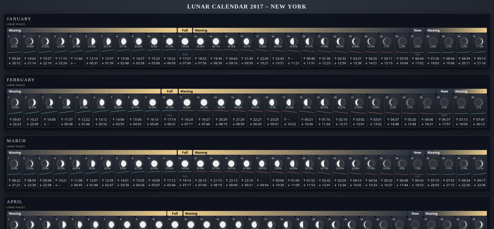
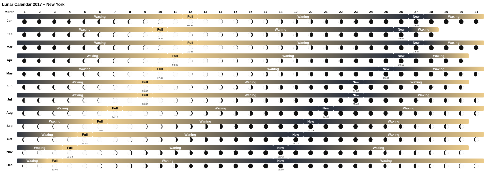

# nocticycle

NoctiCycle is a Python library for exploring the rhythm of the Moon. It computes precise lunar phases, illumination, and event timings, renders elegant SVG moon icons, and generates a full year of location‑specific lunar calendars with accurate astronomical data.

NoctiCycle computes:

- Daily moon phase and illumination
- Exact times of new and full moons (localized to your timezone)
- Waxing/waning classification
- Optional per‑day **illumination trend sparklines**
- Optional rising and setting time
- SVG moon icons rendered directly from astronomical data
- A print‑friendly layout or a rich, cosmetic layout

It’s a zero‑dependency, astronomy‑accurate moon calendar you can generate and view anywhere.

**Default theme**
<a href="screenshots/calendar_2017.png">
  
</a>

**Print format**
<a href="screenshots/calendar_2017-print.png">
  
</a>

---

## 🌟 Why this exists

Most moon calendars online are:

- inaccurate
- cluttered with ads
- not printable
- not customizable
- or require an internet connection

NoctiCycle fixes that:

- Everything is computed locally using **Skyfield** and NASA ephemeris data
- Output is a single, portable HTML file
- You choose the year, location, and display options
- The cosmetic mode produces a modern, elegant layout
- The print mode produces a clean, ink‑friendly version

It’s perfect for planners, journals, almanacs, or anyone who loves tracking the Moon.

---

# 🚀 Features

### ✔ Accurate lunar phase calculations

Uses Skyfield + DE421 ephemeris for precise astronomical results.

### ✔ Localized event times

New/full moon timestamps are converted to your chosen timezone.

### ✔ SVG moon rendering

Each day shows a crisp, resolution‑independent moon icon.

### ✔ Optional illumination percentage

Display the Moon’s brightness for each day.

### ✔ Showing rising and setting times 

Show rise and set times.

### ✔ Optional event times

Show the exact moment of new/full moon on the corresponding day.

### ✔ Optional illumination trend sparkline

A ±3‑day mini‑graph showing illumination change.  
Enabled via:

```
--illumination-trend
```

### ✔ Two display modes

- **Cosmetic mode** (default): modern, elegant, visually rich
- **Print mode** (`--print-format`): minimal, grayscale‑friendly

### ✔ Fully offline

Once generated, the HTML file requires no internet connection.

---

# 📦 Installation

NoctiCycle requires only two external Python packages:

- **Skyfield** — astronomical calculations
- **tzdata** — timezone definitions for systems without IANA zoneinfo
- **geopy** — obtain latitues and longtudes via OpenStreetMap (Nominatim)

Install them with:

```bash
pip install skyfield tzdata geopy
```

---

## 🔧 Why these packages?

### **skyfield**

Used for:

- Loading NASA’s DE421 ephemeris
- Computing lunar positions
- Determining new/full moon events
- Calculating illumination and phase angles

### **tzdata**

Provides timezone definitions for platforms that **don’t ship with IANA zoneinfo**, such as:

- Windows
- Minimal Linux containers
- Some embedded environments

If your system already has full zoneinfo support, `tzdata` simply ensures portability.

---

# 🐍 Using a Python Virtual Environment (Recommended)

A virtual environment keeps dependencies isolated and avoids polluting your system Python.

### 1. Create a virtual environment

```bash
python3 -m venv .venv
```

### 2. Activate it

**macOS / Linux:**

```bash
source .venv/bin/activate
```

**Windows (PowerShell):**

```powershell
.venv\Scripts\Activate.ps1
```

### 3. Install dependencies inside the venv

```bash
pip install skyfield tzdata geopy
```

### 4. Run the script

```bash
python3 nocticycle.py --city "Halifax" --tz "America/Halifax" --year 2025
```

### 5. Deactivate when done

```bash
deactivate
```

---

# 📦 How It Works

## 1. You choose a year **and** location

Both `--city` and `--tz` are **required**:

```
python3 nocticycle.py --city "Halifax" --tz "America/Halifax" --year 2025
```

## 2. NoctiCycle computes all lunar events

- New moons
- Full moons
- Daily illumination
- Phase classification
- Optional trend data

## 3. It renders a complete HTML calendar

- One year
- Twelve months
- Clean layout
- SVG graphics
- Optional sparklines

## 4. You open the file in any browser

`lunar_calendar_2025.html`

---

# ⚙️ Configuration

At the top of the script, you’ll find:

```python
YEAR = 2025
CITY = None          # must be provided via CLI
TZ = None            # must be provided via CLI

SHOW_LUMINANCE = True
SHOW_EVENT_TIME = True
USE_EXACT_EVENT_ILLUMINATION = True

COSMETICS_MODE = True
ILLUMINATION_TREND = False
```

### Required CLI parameters

```
--city "Your City"
--tz "Your/Timezone"
```

### Optional enhancements

```
--illumination-trend
--show-event-time
--show-luminance
--print-format
```

---

# 🏃 Usage

### Basic run (required flags)

```
python3 nocticycle.py --city "Halifax" --tz "America/Halifax"
```

### Specify year

```
python3 nocticycle.py --city "Halifax" --tz "America/Halifax" --year 2027
```

### Print‑friendly layout

```
python3 nocticycle.py --city "Halifax" --tz "America/Halifax" --print-format
```

### Enable illumination trend sparkline

```
python3 nocticycle.py --city "Halifax" --tz "America/Halifax" --illumination-trend
```

### Combine flags

```
python3 nocticycle.py --city "Halifax" --tz "America/Halifax" --year 2026 --illumination-trend --show-event-time
```

---

# 🌓 Display Options

### Illumination percentage

Shows the Moon’s brightness (0–100%).

### Event times

Shows the exact local time of new/full moon.

### Illumination trend sparkline

A ±3‑day mini‑graph showing illumination change.  
Great for quickly seeing waxing vs waning.

### Cosmetic vs Print mode

- Cosmetic mode includes colors, SVGs, sparklines, and layout enhancements.
- Print mode strips everything down for clean physical printing.

---

# 🛡 Error Handling

NoctiCycle:

- Validates timezone names
- Ensures `--city` and `--tz` are provided
- Handles missing ephemeris files
- Warns about invalid years
- Fails gracefully with clear messages

---

# 📄 Output

The script generates:

```
lunar_calendar_<YEAR>.html
```

Open it in any browser.  
Share it. Print it. Use it in journals or planners.

---

# 🧪 Example Workflow

1. You run:
    
    ```
    python3 nocticycle.py --city "Halifax" --tz "America/Halifax" --year 2025 --illumination-trend
    ```
    
2. NoctiCycle computes all lunar data for 2025.
    
3. It generates `lunar_calendar_2025.html`.
    
4. You open it and see:
    
    - Moon icons
    - Illumination
    - Phase bands
    - New/full moon times
    - Trend sparklines
5. You print it or embed it in your digital planner.

---

# ❓ FAQ

## Why do some days show “--” for moonrise or moonset?

**Short answer**: 
Because on some calendar days, the Moon simply does not cross the horizon.

**Long answer**: 
The Moon rises about 50 minutes later each day, and its orbit is tilted relative to Earth. Because of this, several natural situations occur:

    The Moon may rise late at night and the next rise happens after midnight the following day, so one calendar day contains no rise.

    The Moon can stay above the horizon for more than 24 hours, producing a day with no rise or set.

    The Moon can stay below the horizon for more than 24 hours, producing the same effect.

This is normal lunar motion, especially at mid‑northern latitudes.
When no rise or set occurs between 00:00 and 23:59 local time, the calendar displays `--` or a mix of times and `--`:

```↑ --   ↓ --```

This does not mean the Moon is hidden by daylight — it means it never crossed the horizon during that date.

---

# 📜 License (MIT)

```
MIT License

Copyright (c) 2026 Valerio Fuoglio

Permission is hereby granted, free of charge, to any person obtaining a copy
of this software and associated documentation files (the “Software”), to deal
in the Software without restriction, including without limitation the rights
to use, copy, modify, merge, publish, distribute, sublicense, and/or sell
copies of the Software, and to permit persons to whom the Software is
furnished to do so, subject to the following conditions:

The above copyright notice and this permission notice shall be included in
all copies or substantial portions of the Software.

THE SOFTWARE IS PROVIDED “AS IS”, WITHOUT WARRANTY OF ANY KIND, EXPRESS OR
IMPLIED, INCLUDING BUT NOT LIMITED TO THE WARRANTIES OF MERCHANTABILITY,
FITNESS FOR A PARTICULAR PURPOSE AND NONINFRINGEMENT. IN NO EVENT SHALL THE
AUTHORS OR COPYRIGHT HOLDERS BE LIABLE FOR ANY CLAIM, DAMAGES OR OTHER
LIABILITY, WHETHER IN AN ACTION OF CONTRACT, TORT OR OTHERWISE, ARISING FROM,
OUT OF OR IN CONNECTION WITH THE SOFTWARE OR THE USE OR OTHER DEALINGS IN
THE SOFTWARE.
```
